# IACUC Protocols App

[](https://github.com/BabuBahir/iacuc-protocol-review-case-study/actions/workflows/ci.yml)
[](https://codecov.io/gh/BabuBahir/iacuc-protocol-review-case-study)
[](LICENSE)


## Demo

Access the demo at [demo.iacuc.com](https://iacuc-protocol-review-case-study-cl.vercel.app/).


> [!IMPORTANT]
> This environment is not intended for use in production. It is refreshed daily, and the data entered is accessible to everyone.


A real two-tier app: an Express + SQLite API, and a Vite + React frontend
with actual client-side routing (`react-router-dom`). This replaces the
single-file prototype with a proper client/server split, managed as an
**npm workspace**.

```
iacuc-app/
  package.json   root — workspaces + convenience scripts
  server/        Express API + SQLite database  (package: iacuc-server)
  client/        Vite + React frontend           (package: iacuc-client)
```


## 1. Install everything (one command, from the repo root)

```bash
npm install
```

npm workspaces installs both `server/` and `client/` dependencies in one
pass and links the workspace together (single `package-lock.json` at the
root). The server uses Node's **built-in `node:sqlite` module** rather than
a native addon package, so this install never needs to compile anything —
no Visual Studio Build Tools, no Python, no prebuilt-binary lookups.
**Requires Node 22.5 or newer** (check with `node --version`).

## 2. Seed and run the server

```bash
copy server\.env.example server\.env    # Windows
# cp server/.env.example server/.env    # macOS/Linux

npm run seed            # creates server/data/iacuc.db with sample protocols
npm run dev:server      # http://localhost:4000
```

Endpoints — the API surface at this point in development. Each router is
mounted in `server/src/app.js`; every path below is prefixed with `/api`.
See `docs/UI-EXPANSION-PLAN.md` and `ROADMAP.md` for what's coming.

> **Interactive docs**: start the server and open
> http://localhost:4000/api-docs for a Swagger UI where every endpoint below
> can be explored and exercised. The machine-readable spec lives at
> `/api-docs/spec.json` (`server/src/openapi.js`).

### Rest Api's for  CRUD
<details>
<summary><b>Core protocol CRUD</b> (Click to expand)</summary>
  
| Method | Path                       | Description                                     | Status |
|--------|----------------------------|--------------------------------------------------|--------|
| GET    | /api/health                | Liveness check                                   | ✓ |
| GET    | /api/protocols             | List protocols, optional `?q=` search            | ✓ |
| GET    | /api/protocols/summary     | Dashboard metric counts                          | ✓ |
| GET    | /api/protocols/:id         | Single protocol + related items                  | ✓ |
| POST   | /api/protocols             | Create a protocol (starts as Draft)              | ✓ |
| PATCH  | /api/protocols/:id         | Update fields / advance workflow stage           | ✓ |
| DELETE | /api/protocols/:id         | Delete a protocol                                | ✓ |

</details>
 
<details>
<summary><b>  Appendix A application content (per protocol) </b> (Click to expand)</summary>

| Method | Path                                  | Description                                      | Status |
|--------|---------------------------------------|--------------------------------------------------|--------|
| GET    | /api/protocols/:id/procedures         | 15-item procedures checklist (with surgery detail fields) | ✓ |
| PUT    | /api/protocols/:id/procedures         | Replace the checklist for a protocol             | ✓ |
| GET    | /api/protocols/:id/drugs              | Drug/dosing table                                | ✓ |
| POST   | /api/protocols/:id/drugs              | Add a drug row                                   | ✓ |
| PATCH  | /api/protocols/:id/drugs/:drugId      | Update a drug row                                | ✓ |
| DELETE | /api/protocols/:id/drugs/:drugId      | Remove a drug row                                | ✓ |
| GET    | /api/protocols/:id/animal-use         | Planned animal-use table (species/strain/sex/age/count) | ✓ |
| POST   | /api/protocols/:id/animal-use         | Add an animal-use row                            | ✓ |
| PATCH  | /api/protocols/:id/animal-use/:rowId  | Update an animal-use row                         | ✓ |
| DELETE | /api/protocols/:id/animal-use/:rowId  | Remove an animal-use row                         | ✓ |
| GET    | /api/protocols/:id/experiments        | Experiments (endpoints, monitoring, husbandry)   | ✓ |
| POST   | /api/protocols/:id/experiments        | Add an experiment                                | ✓ |
| PATCH  | /api/protocols/:id/experiments/:expId | Update an experiment                             | ✓ |
| DELETE | /api/protocols/:id/experiments/:expId | Remove an experiment                             | ✓ |
| GET    | /api/protocols/:id/rrr                | Structured 3 Rs justifications (Replacement/Refinement/Reduction) | ✓ |
| POST   | /api/protocols/:id/rrr                | Add a 3 Rs entry                                 | ✓ |
| PATCH  | /api/protocols/:id/rrr/:entryId       | Update a 3 Rs entry                              | ✓ |
| DELETE | /api/protocols/:id/rrr/:entryId       | Remove a 3 Rs entry                              | ✓ |
| GET    | /api/protocols/:id/alternatives       | 3 Rs & alternatives summary (literature search, colleague consult, AV consult) | ✓ |
| PATCH  | /api/protocols/:id/alternatives       | Update the alternatives block                    | ✓ |
| GET    | /api/protocols/:id/validation         | Per-section submission completeness + `overall`  | ✓ |
</details>
 
<details>
<summary><b>   Animal usage register (the ledger) </b> (Click to expand)</summary>
  
| Method | Path                            | Description                                     | Status |
|--------|---------------------------------|--------------------------------------------------|--------|
| GET    | /api/protocols/:id/animal-usage | Per-species/pain-category/procedure tallies vs. the approved allowance | ✓ |
| POST   | /api/protocols/:id/animal-usage | Log an ordering/usage transaction               | ✓ |
</details>
<details>
<summary><b>  Admin lookup lists </b> (Click to expand)</summary>
   
| Method | Path                    | Description                          | Status |
|--------|-------------------------|---------------------------------------|--------|
| GET    | /api/admin/species      | List species                          | ✓ |
| POST   | /api/admin/species      | Create a species                      | ✓ |
| DELETE | /api/admin/species/:id  | Delete a species (blocked if in use)  | ✓ |
| GET    | /api/admin/roles        | List roles                            | ✓ |
| POST   | /api/admin/roles        | Create a role                         | ✓ |
| DELETE | /api/admin/roles/:id    | Delete a role                         | ✓ |
| GET    | /api/admin/personnel    | List personnel                        | ✓ |
| POST   | /api/admin/personnel    | Create a personnel member             | ✓ |
| DELETE | /api/admin/personnel/:id| Delete a personnel member             | ✓ |
</details>

<details>
<summary><b> Committee / review workflow </b> (Click to expand)</summary>
 

| Method | Path                                        | Description                                      | Status |
|--------|---------------------------------------------|---------------------------------------------------|--------|
| GET    | /api/committee/protocols                    | Protocols in review, with votes/assignments/comments | ✓ |
| GET    | /api/committee/voters                       | Committee-eligible voters                         | ✓ |
| GET    | /api/committee/protocols/:id/votes          | Vote history + live tally for a protocol          | ✓ |
| POST   | /api/committee/protocols/:id/votes          | Cast a vote                                       | ✓ |
| GET    | /api/committee/protocols/:id/reviews        | Full review history (votes + assignments + comments) | ✓ |
| POST   | /api/committee/protocols/:id/reviews        | Submit a review (Approved / Modifications Required / Tabled) | ✓ |
| POST   | /api/committee/protocols/:id/comments       | Add a section-specific review comment             | ✓ |
| PATCH  | /api/committee/protocols/:id/assign         | Upsert a reviewer assignment (Primary/Secondary/Designated Member) | ✓ |
| PATCH  | /api/committee/protocols/:id/review-method  | Set review method (`FCR` / `DMR`)                 | ✓ |
</details>

<details>
<summary><b> Personnel compliance (CITI training + OHSP clearance) </b> (Click to expand)</summary> 

| Method | Path                                          | Description                                      | Status |
|--------|-----------------------------------------------|---------------------------------------------------|--------|
| GET    | /api/personnel/compliance                     | All personnel with derived training/OHSP/compliant status | ✓ |
| GET    | /api/personnel/:id/training                   | A person's training records + overall status      | ✓ |
| POST   | /api/personnel/:id/training                   | Add a training record                             | ✓ |
| PATCH  | /api/personnel/:id/training/:trainingId       | Update a training record (e.g. extend an expiry)  | ✓ |
| DELETE | /api/personnel/:id/training/:trainingId       | Remove a training record                          | ✓ |
| GET    | /api/personnel/:id/ohsp                       | OHSP clearance row (defaults to Pending)          | ✓ |
| POST   | /api/personnel/:id/ohsp                       | Upsert OHSP status (`Pending`/`Cleared`/`Denied`) | ✓ |
| GET    | /api/protocols/:id/personnel                  | Per-listed-person compliance + `all_compliant` for a protocol | ✓ |
</details>

### Planned / future endpoints

Documented but **not implemented yet** — tracked in `docs/UI-EXPANSION-PLAN.md`
(domains B, E, F) and `ROADMAP.md`. Do not build against these yet; paths are
subject to change as the schema lands.

| Domain | Planned endpoint(s)                                                         | Source | Status |
|--------|-----------------------------------------------------------------------------|--------|--------|
| B. Amendments & renewals | `POST` / `GET /api/protocols/:id/amendments`, `POST /api/protocols/:id/renewals` | UI-EXPANSION-PLAN §B, ROADMAP items 2–3 | ✗ |
| E. PAM & incidents | `POST /api/incidents`, `GET /api/protocols/:id/pam-audits`, `PATCH /api/incidents/:id` | UI-EXPANSION-PLAN §E | ✗ |
| F. Facilities & inspections | `GET /api/facilities`, `POST /api/inspections`, `GET /api/inspections/:id/deficiencies` | UI-EXPANSION-PLAN §F | ✗ |
| Transfer ownership | Approval-queue reassignment of a protocol to another PI (required reason, audit trail) | ROADMAP item 10 | ✗ |
| File attachments | Real uploads for protocol narratives, SOPs, training certs | ROADMAP item 7 | ✗ |
| Search filter-builder + CSV export | Stackable field/operator/value filters across protocols & the register; CSV on every result set | ROADMAP item 8 | ✗ |
| AAALAC compliance reports | Restraint/euthanasia/surgery/drug reports by species | ROADMAP item 9 | ✗ |
| Audit logging | Who accessed/changed what, when (prerequisite for the AI-safety guardrails in AGENTS.md §3) | ROADMAP item 11 | ✗ |

## 3. Database schema

Every table is created in `server/src/db.js` (SQLite, `node:sqlite`). All
child rows hang off `protocols` via a `protocol_id` foreign key with
`ON DELETE CASCADE`; the one exception is `personnel.role_id → roles`, which
is `ON DELETE RESTRICT` so a role can't be deleted while people still hold it.
Note `protocols.species` and the register's `species_strain` are free text —
the `species` table is an admin picklist, not a foreign key target.

```mermaid
erDiagram
    protocols ||--o{ related_items : "has"
    protocols ||--o{ protocol_procedures : "has"
    protocols ||--o{ protocol_drugs : "has"
    protocols ||--o{ protocol_animal_use : "has"
    protocols ||--o{ protocol_experiments : "has"
    protocols ||--o| protocol_alternatives : "has (1:1)"
    protocols ||--o{ protocol_rrr_entries : "has"
    protocols ||--o{ animal_usage_transactions : "ledger of"
    protocols ||--o{ protocol_votes : "receives votes"
    protocols ||--o{ protocol_review_assignments : "has"
    protocols ||--o{ protocol_review_comments : "receives comments"
    roles ||--o{ personnel : "occupies"
    personnel ||--o{ personnel_training : "has"
    personnel ||--o| personnel_ohsp : "has (0..1)"
    personnel ||--o{ protocol_votes : "casts"
    personnel ||--o{ protocol_review_assignments : "is assigned"
    personnel ||--o{ protocol_review_comments : "writes"

    protocols {
        string id PK
        string title
        string pi
        string status
        string pain_category
        string review_method
    }
    related_items {
        int id PK
        string protocol_id FK
        string list_name
        string label
    }
    species {
        int id PK
        string name
    }
    roles {
        int id PK
        string name
        bool is_committee
    }
    personnel {
        int id PK
        string name
        string email
        int role_id FK
    }
    personnel_training {
        int id PK
        int personnel_id FK
        string course
        string expires_date
    }
    personnel_ohsp {
        int personnel_id PK, FK
        string status
    }
    protocol_votes {
        int id PK
        string protocol_id FK
        int personnel_id FK
        string vote
        string comment
    }
    protocol_review_assignments {
        int id PK
        string protocol_id FK
        int personnel_id FK
        string role
    }
    protocol_review_comments {
        int id PK
        string protocol_id FK
        int personnel_id FK
        string section
    }
    protocol_procedures {
        int id PK
        string protocol_id FK
        string procedure_key
        bool checked
    }
    protocol_drugs {
        int id PK
        string protocol_id FK
        string drug
        string dose
    }
    protocol_animal_use {
        int id PK
        string protocol_id FK
        string species_strain
        int max_count
    }
    protocol_experiments {
        int id PK
        string protocol_id FK
        string name
    }
    protocol_alternatives {
        string protocol_id PK, FK
        string lit_databases
        string av_consult_date
    }
    protocol_rrr_entries {
        int id PK
        string protocol_id FK
        string rrr_type
        string method
    }
    animal_usage_transactions {
        int id PK
        string protocol_id FK
        string species_strain
        int quantity
        string type
    }
```

<details>
<summary><b>Entity-relationship diagram</b> (Click to expand)</summary>



</details>

Key facts to read from the diagram:

- **Everything belongs to a protocol.** The Appendix A content
  (procedures, drugs, animal use, experiments, 3 Rs entries), the review
  workflow rows (votes, assignments, comments), and the usage ledger all
  cascade-delete with their `protocols` row.
- **`protocol_alternatives` is 1:1** with `protocols` (its primary key *is*
  `protocol_id`); everything else is 1:N.
- **Personnel are shared, not per-protocol.** Votes, review assignments,
  comments, training records and OHSP clearance all reference the same
  `personnel` row, and personnel may appear on multiple protocols via
  `related_items` (list_name = `'Personnel'`).
- **The planned allowance vs. the actual ledger stay distinct:**
  `protocol_animal_use.max_count` is the *approved* allowance;
  `animal_usage_transactions` records the *actual* orders/uses (the API sums
  the latter and compares it against the former).

## 4. Run the client

In a second terminal:

```bash
npm run dev:client      # http://localhost:5173
```

Vite proxies any `/api/*` request to `http://localhost:4000` in dev (see
`client/vite.config.js`), so the frontend never needs a hardcoded API URL.

## 5. Open it

Visit `http://localhost:5173`. Clicking a row on the list page navigates to
`/protocols/:id` (a real URL, so refresh/back/forward all work correctly) and
fetches that record from the API.

## Working with individual packages

```bash
npm run seed --workspace=server
npm run build --workspace=client
cd server && npm run dev
```

## Swapping SQLite for Postgres / MySQL later

Every route in `server/src/routes/protocols.js` only talks to the `db`
object exported from `server/src/db.js`. To move to Postgres:

1. `npm install pg --workspace=server`
2. Replace the contents of `db.js` with a `pg.Pool` connection and rewrite
   the handful of prepared statements in `protocols.js` as parameterized
   `pool.query(...)` calls (mostly 1:1 — same SQL, different driver).
3. Point `DB_PATH`/connection string at your Postgres instance via `.env`.

Nothing in the client needs to change, since it only ever talks to the
`/api/protocols` HTTP endpoints.

## Deploying

- **Server**: any Node host (Render, Fly.io, Railway, a VPS). Set
  `CLIENT_ORIGIN` to your deployed frontend's URL for CORS.
- **Client**: `npm run build --workspace=client` produces static files in
  `client/dist/` that can be served from any static host (Vercel, Netlify,
  S3+CloudFront). Point its API calls at your deployed server URL instead of
  the dev proxy (e.g. via a `VITE_API_URL` env var and updating `api.js`).
